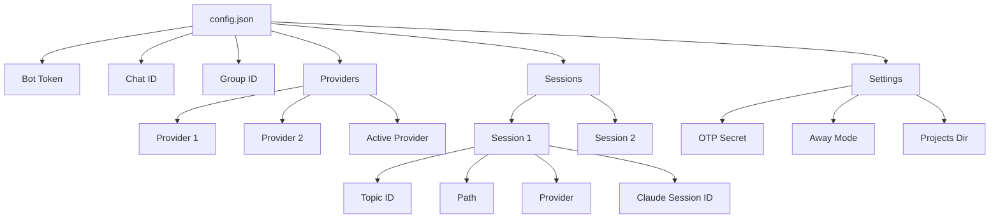

# Architecture

This document describes the system architecture of ccc (Claude Code Companion), its components, data flow, and design decisions.

## High-Level Architecture

```
┌─────────────────────────────────────────────────────────────────┐
│                         CLIENT LAYER                            │
├─────────────────────────────────────────────────────────────────┤
│  📱 Mobile Phone          💻 Terminal/Tmux                      │
│       │                         │                               │
│       ▼                         │                               │
│  ┌─────────┐                   │                               │
│  │Telegram │                   │                               │
│  └─────────┘                   │                               │
└─────────────────────────────────────────────────────────────────┘
            │                           │
            ▼                           │
┌─────────────────────────────────────────────────────────────────┐
│                          CCC SERVICE                             │
├─────────────────────────────────────────────────────────────────┤
│  ┌──────────┐  ┌─────────────┐  ┌──────────┐  ┌──────────┐   │
│  │ccc listen│  │Config Manager│  │Hook Syst.│  │Tmux Mgr. │   │
│  └──────────┘  └─────────────┘  └──────────┘  └──────────┘   │
│        │              │               │              │          │
│        │              └───────────────┴──────────────┘          │
│        │                     ┌─────────────┐                    │
│        └────────────────────►│Session Mgr. │                    │
│                             └─────────────┘                    │
└─────────────────────────────────────────────────────────────────┘
                                        │
                                        ▼
┌─────────────────────────────────────────────────────────────────┐
│                         CLAUDE CODE                             │
├─────────────────────────────────────────────────────────────────┤
│  ┌──────────────┐        ┌──────────────┐                       │
│  │Claude Code CLI│────────►│Transcript Files│                     │
│  └──────────────┘        └──────────────┘                       │
└─────────────────────────────────────────────────────────────────┘

LEGEND:
══════  Messages/Notifications
──────  Tmux Operations
──────  Config/State
```

## Component Overview

### Core Components

| Component | File | Responsibility |
|-----------|------|---------------|
| **Telegram Listener** | `telegram.go`, `commands.go` | Polls Telegram for messages, handles commands, routes prompts to sessions |
| **Tmux Manager** | `tmux.go` | Creates/manages tmux sessions, switches windows, detects Claude state |
| **Session Manager** | `session.go`, `session_lookup.go`, `session_persist.go` | Manages session lifecycle, creates topics, persists state |
| **Config Manager** | `config_load.go`, `config_save.go`, `config_paths.go`, `config_validation.go`, `types.go` | Loads/saves config atomically, validates, manages providers and sessions |
| **Hook System** | `hooks.go` | Installs Claude Code hooks, reads transcripts, sends notifications |
| **Provider Abstraction** | `provider.go` | Provider-agnostic interface for AI providers |
| **Message Ledger** | `ledger.go` | Tracks message delivery state between terminal and Telegram |

## Message Flow

### 1. Creating a New Session

```
┌─────────────────────────────────────────────────────────────────┐
│                    SESSION CREATION FLOW                         │
└─────────────────────────────────────────────────────────────────┘

  User           Telegram        ccc listen     Session Mgr    Tmux      Claude
   │                 │                │              │         │
   │  /new myproject │                │              │         │
   ├────────────────►│                │              │         │
   │                 │  Message recv   │              │         │
   │                 ├───────────────►│              │         │
   │                 │                │  Create topic │         │
   │                 │                ├─────────────►│         │
   │                 │                │              │ Create window
   │                 │                │              ├────────►│
   │                 │                │              │         │ ccc run
   │                 │                │              │         ├──────►
   │                 │                │              │         │ Running
   │                 │                │  Created     │         │
   │                 │                │◄─────────────┤         │
   │                 │  🚀 Started!    │              │         │
   │◄────────────────│◄───────────────┤              │         │
   │                                                                         │
```

### 2. Sending a Prompt

```
┌─────────────────────────────────────────────────────────────────┐
│                      PROMPT PROCESSING FLOW                     │
└─────────────────────────────────────────────────────────────────┘

  User       Telegram      ccc listen     Tmux Mgr    Claude    Hook System
   │             │              │            │          │          │
   │ "Fix bug"   │              │            │          │          │
   ├───────────►│              │            │          │          │
   │             │  Message recv │            │          │          │
   │             ├─────────────►│            │          │          │
   │             │              │ Find session│          │          │
   │             │              ├───────────►│          │          │
   │             │              │            │ Switch   │          │
   │             │              │            ├─────────►│          │
   │             │              │            │         Send prompt│     │
   │             │              │            ├──────────────────►│     │
   │             │              │            │          Process  │    │
   │             │              │            │          ├──────►│     │
   │             │              │            │          Write transcript│ │
   │             │              │            │          │   │      │
   │             │              │            │          │  ◄─────┤     │
   │             │              │            │          │  Poll   │     │
   │             │              │            │          │  │      │     │
   │             │              │            │          │  ◄─────┤     │
   │             │              │            │          │        │     │
   │             │              │            │          │  New content│
   │             │              │            │          │  │      │     │
   │             │              │            │          │  ◄─────┤     │
   │             │              │            │          │        │     │
   │             │              │  Response   │          │        │     │
   │             │  Claude response◄────────────┼──────────┼────────┤     │
   │  Response   ◄───────────────┤            │          │        │     │
   │◄────────────│              │            │          │        │     │
```

### 3. Hook Notification Flow

```
┌─────────────────────────────────────────────────────────────────┐
│                    NOTIFICATION WORKFLOW                         │
└─────────────────────────────────────────────────────────────────┘

  Claude Code    Transcript File    Hook System    Response Parser    Telegram    User
      │                 │                 │                │             │         │
      │ Write           │                 │                │             │         │
      ├────────────────►│                 │                │             │         │
      │                 │                 │                │             │         │
      │                 │                 │  Poll           │             │         │
      │                 │◄────────────────┤                │             │         │
      │                 │                 │  New content    │             │         │
      │                 │                 ├───────────────►│             │         │
      │                 │                 │                │ Extract     │         │
      │                 │                 │                ├──────────►│         │
      │                 │                 │                │          Send│        │
      │                 │                 │                ├──────────►│         │
      │                 │                 │                │             │ Notify  │
      │                 │                 │                │             ├────────►│
```

## Session Lifecycle

```
┌─────────────────────────────────────────────────────────────────┐
│                      SESSION LIFECYCLE                           │
└─────────────────────────────────────────────────────────────────┘

    ┌─────────┐
    │  START  │
    └────┬────┘
         │ /new command
         ▼
    ┌─────────┐
    │Creating │ ◄─────────────┐
    └────┬────┘                │
         │ Topic created        │
         ▼                      │
    ┌─────────┐                │
    │Starting │                │
    └────┬────┘                │
         │ Claude started       │
         ▼                      │
    ┌─────────┐                │
    │ Running │◄───────────────┘
    └────┬────┘
         │
    ┌────┴────┐
    │         │
    ▼         ▼
┌─────────┐ ┌───────┐
│  Idle   │ │Processing│
│(waiting │ │  (working)│
│ input)  │ └─────┬─────┘
└────┬────┘       │
     │             │
     │             │◄──────┐
     │             │       │ Prompt
     │             │       │ received
     │             ▼       │
     │         ┌───────┐   │
     │         │Running│───┘
     │         └───────┘
     │             │
     │             │ User disconnects
     │             ▼
     │         ┌─────────┐
     │         │ Detached│
     │         │(background)
     │         └────┬────┘
     │              │
     │              │ /delete or error
     │              ▼
     │         ┌─────────┐
     │         │ Stopped │
     │         └────┬────┘
     │              │
     └──────────────┘
```

## Tmux Integration

### Window Management

Each session gets its own tmux window within the shared "ccc" session:

```
ccc (tmux session)
├── myproject (window)
├── experiment (window)
└── test (window)
```

### Claude Detection

The system uses multiple methods to detect if Claude is running:

1. **Process-based detection**: Checks if `claude` or `node` process is active
2. **Prompt-based detection**: Looks for Claude's prompt character (❯) in pane content
3. **Child process detection**: Checks if shell has Claude as child process
4. **npm Claude detection**: Handles npm-installed Claude via `claude/cli`

### Session Switching

When switching between sessions:

1. Check if target window exists
2. Detect if Claude is running in target
3. If `skipRestart=true`: Preserve session, send prompts directly
4. If `skipRestart=false`: May restart to ensure clean state

## Provider System

ccc uses a provider abstraction to support multiple AI providers:

### Provider Interface

```go
type Provider interface {
    Name() string
    BaseURL() string
    AuthToken(config *Config) string
    Models() ModelConfig
    ConfigDir() string
    TranscriptPath(sessionID string) string
    EnvVars(config *Config) []string
    IsBuiltin() bool
}
```

### Provider Types

1. **BuiltinProvider**: Default Anthropic provider using environment variables
2. **ConfiguredProvider**: Custom providers from `config.json`

### Provider Resolution

```
┌─────────────────────────────────────────────────────────────────┐
│                    PROVIDER SELECTION FLOW                        │
└─────────────────────────────────────────────────────────────────┘

  Session Request
        │
        ▼
  ┌───────────────────┐
  │ Provider Specified?│
  └────┬──────────────┘
       │
  ┌────┴────┐
  │         │
 Yes       No
  │         │
  ▼         ▼
┌────────┐ ┌──────────────────┐
│Use     │ │Active Provider Set?│
│Specified│ └────┬──────────────┘
└────┬───┘      │
     │         │
     │    ┌────┴────┐
     │    │         │
     │   Yes       No
     │    │         │
     │    ▼         ▼
     │ ┌──────┐ ┌────────┐
     │ │Use   │ │Use     │
     │ │Active│ │Builtin │
     │ └──┬───┘ └────────┘
     │    │
     ▼    ▼
┌───────────────────┐
│ Apply Provider   │
│ Environment Vars │
└─────────┬─────────┘
          │
          ▼
┌───────────────────┐
│  Start Claude     │
│      Code         │
└───────────────────┘
```

## Configuration System

ccc uses a modular configuration system split across multiple files following Single Responsibility Principle.

### Config File Structure

The configuration system is organized into specialized files:

| File | Purpose |
|------|---------|
| **types.go** | All struct definitions (Config, SessionInfo, ProviderConfig, Telegram types, etc.) |
| **config_paths.go** | Path utilities (configDir, cacheDir, expandPath, getProjectsDir, etc.) |
| **config_validation.go** | Config validation (validateConfig checks providers and sessions) |
| **config_load.go** | Config loading with migration from old formats |
| **config_save.go** | Atomic config saving using write-then-rename pattern |
| **session_lookup.go** | Session query functions (getSessionByTopic, findSessionBy*, findSession) |
| **session_persist.go** | Session write operations (persistClaudeSessionID) |
| **provider.go** | Provider interface and helper functions (getActiveProvider, getProvider, etc.) |

### Config File Location

```
~/.config/ccc/config.json
```

Legacy location (auto-migrated on first load):
```
~/.ccc.json
```

### Atomic Write Pattern

Config writes use atomic operations to prevent corruption from concurrent writes:

```
┌─────────────────────────────────────────────────────────────────┐
│                    ATOMIC CONFIG WRITE                           │
└─────────────────────────────────────────────────────────────────┘

1. Marshal config to JSON
        │
        ▼
2. Create temp file (config-*.json.tmp) with 0600 permissions
        │
        ▼
3. Write data to temp file
        │
        ▼
4. Sync temp file to disk (fsync)
        │
        ▼
5. Close temp file
        │
        ▼
6. Atomic rename (temp → config.json)
        │
        ▼
7. Sync parent directory to persist rename
        │
        ▼
   ✅ Complete
```

This ensures:
- No partial/corrupt config files
- Safe concurrent writes from multiple processes
- Crash consistency (fsync before rename)

### Config Migration

The system automatically migrates configs from old formats:

**Old Format** (map[string]int64 for sessions):
```json
{
  "sessions": {
    "myproject": 12345
  }
}
```

**New Format** (SessionInfo with path):
```json
{
  "sessions": {
    "myproject": {
      "topic_id": 12345,
      "path": "/home/user/Projects/myproject"
    }
  }
}
```

Migration happens automatically on first load and is saved back.

## Hook System

### Hook Installation

Hooks are installed per-project when a session is created:

```bash
.claude/
├── hooks/
│   ├── pre-run   # Runs before any command
│   ├── post-run   # Runs after command completes
│   └── ask        # Runs before permission approval
└── settings.json
```

### Hook Functionality

1. **Transcript Monitoring**: Polls `transcript.jsonl` for new content
2. **Response Extraction**: Parses assistant responses and tool results
3. **Telegram Notifications**: Sends responses back to the appropriate topic
4. **Permission Handling**: Integrates with OTP mode for remote approval

### Per-Project Hooks

ccc supports per-project hook installation:

```bash
ccc install-hooks        # Install hooks in current project
ccc cleanup-hooks        # Remove hooks from current project
```

## Configuration Structure



### Permission Modes

| Mode | Behavior |
|------|----------|
| **Auto-approve** (default) | All permissions automatically approved |
| **OTP** | Remote prompts require TOTP code approval |

### Data Flow

```
┌─────────────────────────────────────────────────────────────────┐
│                    AUTHORIZATION & PERMISSION FLOW                │
└─────────────────────────────────────────────────────────────────┘

  User Message
      │
      ▼
┌─────────────────┐
│  Authorized?    │
└────┬────────────┘
     │
     │
 ┌───┴───┐
 │       │
 No      Yes
 │       │
 ▼       ▼
Rejected │
     ┌───────────────────┐
     │   OTP Mode?       │
     └────┬──────────────┘
          │
     ┌────┴─────┐
     │          │
    Yes        No
     │          │
     ▼          ▼
┌────────────────┐  ┌─────────┐
│Permission Needed?│  │Send to  │
└────┬─────────┘  │Claude   │
     │            └─────────┘
 ┌───┴───┐
 │       │
 No      Yes
 │       │
 ▼       ▼
┌─────────┐ ┌────────────┐
│Send to  │ │Request OTP │
│Claude  │ │   Code     │
└─────────┘ └──────┬─────┘
                  │
                  ▼
          ┌────────────┐
          │User Provides│
          │    OTP      │
          └──────┬─────┘
                 │
                 ▼
          ┌────────────┐
          │   Valid?    │
          └────┬───────┘
               │
        ┌──────┴──────┐
        │             │
       Yes           No
        │             │
        ▼             ▼
    ┌─────────┐  ┌─────────┐
    │Send to  │  │Rejected │
    │Claude  │  └─────────┘
    └─────────┘
```

## File System Layout

```
~/
├── .config/
│   └── ccc/
│       └── config.json          # Main configuration
├── .claude/
│   ├── hooks/                   # Per-project hooks
│   │   ├── pre-run
│   │   ├── post-run
│   │   └── ask
│   ├── settings.json            # Claude Code settings
│   └── transcripts/             # Claude Code transcripts
│       └── <session-id>/
│           └── transcript.jsonl
├── Projects/                    # Default projects directory
│   ├── myproject/
│   └── experiment/
└── bin/
    └── ccc                       # Binary
```

## Concurrency Model

### Single Listener Instance

Only one `ccc listen` instance runs at a time, enforced via lock file:

```
~/Library/Caches/ccc/ccc.lock (macOS)
~/.cache/ccc/ccc.lock (Linux)
```

### Message Processing

- **Sequential processing**: Messages processed one at a time
- **Non-blocking I/O**: Uses Telegram long-polling with timeout
- **Graceful shutdown**: Handles SIGTERM/SIGINT for clean exit

### Session Isolation

- Each session runs in its own tmux window
- Sessions are isolated but share the same tmux session
- No shared state between sessions except config file

## Error Handling

### Retry Logic

| Operation | Retry Strategy |
|-----------|---------------|
| Telegram API | Exponential backoff, max 3 attempts |
| Claude Detection | Multiple detection methods with fallback |
| Tmux Operations | Retry once on failure |
| Hook Transcript Read | Continuous polling, no retries on parse errors |

### Failure Modes

1. **Claude Not Found**: Falls back to alternative paths
2. **Tmux Not Available**: Provides clear error message
3. **Config Corruption**: Attempts migration from old format
4. **Network Issues**: Continues polling, logs errors

## Performance Considerations

### Transcript Polling

- Polling interval: 500ms
- Only polls sessions with active topics
- Uses file modification time for optimization

### Memory Usage

- Transcript reader keeps only recent entries in memory
- Message ledger bounded by file size
- No in-memory caching of full conversation history

### Network Usage

- Telegram messages limited to 4000 characters (split automatically)
- File transfer uses relay for large files (>50MB)
- Voice messages transcribed before sending to Claude

## Team Sessions (Multi-Pane Architecture)

### Overview

Team sessions provide a 3-pane tmux layout where specialized AI agents collaborate:
- **Planner** (left pane) - Plans and breaks down tasks
- **Executor** (middle pane) - Implements code changes
- **Reviewer** (right pane) - Reviews and validates changes

### Architecture

```
┌─────────────────────────────────────────────────────────────────┐
│                    TEAM SESSION LAYOUT                            │
├─────────────────────────────────────────────────────────────────┤
│                                                                  │
│  ┌─────────────┬─────────────┬─────────────┐                    │
│  │   Planner   │  Executor   │  Reviewer   │                    │
│  │  (Pane 1)   │  (Pane 2)   │  (Pane 3)   │                    │
│  │             │             │             │                    │
│  │ CCC_ROLE=   │ CCC_ROLE=   │ CCC_ROLE=   │                    │
│  │ "planner"   │ "executor"  │ "reviewer"  │                    │
│  └─────────────┴─────────────┴─────────────┘                    │
│                                                                  │
│  Each pane runs its own Claude process with unique:            │
│  - Claude session ID                                             │
│  - Transcript file (session-{role}.jsonl)                       │
│  - Environment context (CCC_ROLE)                                │
│                                                                  │
└─────────────────────────────────────────────────────────────────┘
```

### Key Design Decisions

1. **Single Telegram Topic**: All three panes share one Telegram topic
   - Messages are prefixed with role: `[Planner]`, `[Executor]`, `[Reviewer]`
   - User routes commands using `/planner`, `/executor`, `/reviewer`

2. **Role Determination**: Hooks identify which pane sent a message by:
   - Primary: Query tmux for active pane name (Planner/Executor/Reviewer)
   - Fallback 1: Query tmux for active pane index (1=planner, 2=executor, 3=reviewer)
   - Fallback 2: Extract role from transcript path (e.g., `session-planner.jsonl`)
   - Store Claude session ID per-pane in `config.TeamSessions[topic_id].Panes[role]`

3. **Dedicated Tmux Session**: Team sessions use `ccc-team` tmux session
   - Isolated from single-pane sessions (in `ccc` session)
   - Each team session is a window: `ccc-team:sessionname`

4. **Config Storage**: Team sessions stored separately from regular sessions
   - Regular sessions: `config.Sessions[session_name]`
   - Team sessions: `config.TeamSessions[topic_id]`

### Session Creation Flow

```
User: /team demo-team
       │
       ▼
1. Show provider selection keyboard (if no provider specified)
       │
       ▼
2. User selects provider (e.g., "zai", "anthropic")
       │
       ▼
3. Create project folder: ~/Projects/demo-team/
       │
       ▼
4. Initialize SessionInfo with Type="team", LayoutName="team-3pane", ProviderName="zai"
       │
       ▼
5. Create Telegram topic for the team
       │
       ▼
6. Create 3-pane tmux layout (Planner | Executor | Reviewer)
       │
       ▼
7. Start Claude in all panes with:
       - CCC_ROLE environment variable ("planner", "executor", "reviewer")
       - --provider flag ("zai")
       │
       ▼
8. Each pane gets unique:
   - Claude session ID
   - Transcript file (session-{role}.jsonl)
   - Tmux pane ID (%1, %2, %3)
   - Provider configuration
```

### Critical Bug Fix History

**Bug #1: Pane ID Collision** (FIXED)
- **Problem**: All panes got the same Claude session ID, breaking role identification
- **Solution**: Use transcript path to infer role and store session ID per-pane
- **Impact**: Role prefixes now display correctly in Telegram

**Bug #2: Missing Nil Checks** (FIXED)
- **Problem**: TeamSessions access could panic with old config files
- **Solution**: Added defensive nil checks before all TeamSessions iterations
- **Impact**: Robust handling of legacy configs

**Bug #3: Provider Not Honored** (FIXED - 2026-03-21)
- **Problem**: Team session panes all used default provider instead of selected provider
- **Solution**: Pass `--provider` flag to `ccc run` command in each pane
- **Impact**: All three panes now correctly use the selected provider
- **Affects**: CLI (`ccc team new <name> --provider <provider>`), Telegram (`/team <name>@<provider>`)

**Bug #4: Role Name Display Bug** (FIXED - 2026-03-21)
- **Problem**: Role names displayed incorrectly in Telegram (e.g., planner showing [Executor])
- **Root Cause**: 
  - Transcript files named `transcript.jsonl` (not `session-planner.jsonl`) - path inference failed
  - `os.Getenv("CCC_ROLE")` didn't work (hooks run in ccc service, not pane context)
  - Random pane assignment caused wrong Claude session ID → role mapping
- **Solution**: 
  - Query tmux for active pane index/name to determine role
  - Name panes during creation: Pane 1="Planner", Pane 2="Executor", Pane 3="Reviewer"
  - Store Claude session ID in correct pane using tmux query
- **Impact**: Telegram messages now show correct role prefix `[Planner]`, `[Executor]`, `[Reviewer]`

### Configuration

Team sessions in `config.json`:

```json
{
  "team_sessions": {
    "6123": {
      "topic_id": 6123,
      "path": "/home/user/Projects/demo-team",
      "session_name": "demo-team",
      "type": "team",
      "layout_name": "team-3pane",
      "panes": {
        "planner": {
          "claude_session_id": "uuid-1",
          "pane_id": "%1",
          "role": "planner"
        },
        "executor": {
          "claude_session_id": "uuid-2",
          "pane_id": "%2",
          "role": "executor"
        },
        "reviewer": {
          "claude_session_id": "uuid-3",
          "pane_id": "%3",
          "role": "reviewer"
        }
      }
    }
  }
}
```

### Message Routing

When a message arrives in a team session topic:

1. **Detect team session**: `config.IsTeamSession(topicID)`
2. **Get session info**: `config.GetTeamSession(topicID)`
3. **Match pane**: Find pane by matching Claude session ID from hook
4. **Extract role**: Get role from matching pane
5. **Format message**: `*{session_name}*: [{Role}] {message}`
6. **Send to Telegram**: With role prefix visible

### File Organization

Team session code is organized across multiple files:

| File | Responsibility |
|------|---------------|
| `team_commands.go` | CLI commands (`/team`, `/team new`, etc.) |
| `team_runtime.go` | Tmux layout creation, pane management |
| `session/team_runtime.go` | Session runtime interface implementation |
| `session_lookup.go` | Session lookup (checks both Sessions and TeamSessions) |
| `session_persist.go` | Claude session ID persistence per-pane |
| `hooks.go` | Hook delivery with role prefix formatting |

### Tmux Commands

```bash
# Attach to specific pane
ccc attach demo-team --role planner

# Start Claude in all panes
ccc team start demo-team

# Stop all Claude processes (keeps layout)
ccc team stop demo-team

# Delete entire team session
ccc team delete demo-team
```

