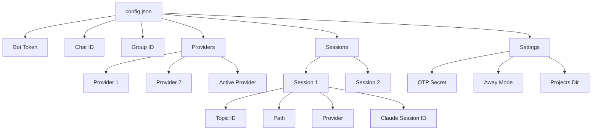

# Architecture

This document describes the system architecture of ccc (Claude Code Companion), its components, data flow, and design decisions.

## High-Level Architecture

```
┌─────────────────────────────────────────────────────────────────┐
│                         CLIENT LAYER                            │
├─────────────────────────────────────────────────────────────────┤
│  📱 Mobile Phone          💻 Terminal/Tmux                      │
│       │                         │                               │
│       ▼                         │                               │
│  ┌─────────┐                   │                               │
│  │Telegram │                   │                               │
│  └─────────┘                   │                               │
└─────────────────────────────────────────────────────────────────┘
            │                           │
            ▼                           │
┌─────────────────────────────────────────────────────────────────┐
│                          CCC SERVICE                             │
├─────────────────────────────────────────────────────────────────┤
│  ┌──────────┐  ┌─────────────┐  ┌──────────┐  ┌──────────┐   │
│  │ccc listen│  │Config Manager│  │Hook Syst.│  │Tmux Mgr. │   │
│  └──────────┘  └─────────────┘  └──────────┘  └──────────┘   │
│        │              │               │              │          │
│        │              └───────────────┴──────────────┘          │
│        │                     ┌─────────────┐                    │
│        └────────────────────►│Session Mgr. │                    │
│                             └─────────────┘                    │
└─────────────────────────────────────────────────────────────────┘
                                        │
                                        ▼
┌─────────────────────────────────────────────────────────────────┐
│                         CLAUDE CODE                             │
├─────────────────────────────────────────────────────────────────┤
│  ┌──────────────┐        ┌──────────────┐                       │
│  │Claude Code CLI│────────►│Transcript Files│                     │
│  └──────────────┘        └──────────────┘                       │
└─────────────────────────────────────────────────────────────────┘

LEGEND:
══════  Messages/Notifications
──────  Tmux Operations
──────  Config/State
```

## Component Overview

### Core Components

| Component | File | Responsibility |
|-----------|------|---------------|
| **Telegram Listener** | `telegram.go`, `commands.go` | Polls Telegram for messages, handles commands, routes prompts to sessions |
| **Tmux Manager** | `tmux.go` | Creates/manages tmux sessions, pane lifecycle, detects Claude state |
| **Session Manager** | `session.go`, `session_lookup.go`, `session_persist.go` | Session lifecycle, pane CRUD, creates topics, persists state |
| **Config Manager** | `config_load.go`, `config_save.go`, `config_paths.go`, `config_validation.go`, `types.go` | Loads/saves config atomically, validates, manages providers and sessions |
| **Hook System** | `hooks.go` | Installs Claude Code hooks, reads transcripts, sends notifications (pane-aware routing) |
| **Provider Abstraction** | `provider.go` | Provider-agnostic interface for AI providers |
| **Message Ledger** | `ledger.go` | Tracks message delivery state between terminal and Telegram |

## Message Flow

### 1. Creating a New Session

```
┌─────────────────────────────────────────────────────────────────┐
│                    SESSION CREATION FLOW                         │
└─────────────────────────────────────────────────────────────────┘

  User           Telegram        ccc listen     Session Mgr    Tmux      Claude
   │                 │                │              │         │
   │  /new myproject │                │              │         │
   ├────────────────►│                │              │         │
   │                 │  Message recv   │              │         │
   │                 ├───────────────►│              │         │
   │                 │                │  Create topic │         │
   │                 │                ├─────────────►│         │
   │                 │                │              │ Create window
   │                 │                │              ├────────►│
   │                 │                │              │         │ ccc run
   │                 │                │              │         ├──────►
   │                 │                │              │         │ Running
   │                 │                │  Created     │         │
   │                 │                │◄─────────────┤         │
   │                 │  🚀 Started!    │              │         │
   │◄────────────────│◄───────────────┤              │         │
   │                                                                         │
```

### 2. Sending a Prompt

```
┌─────────────────────────────────────────────────────────────────┐
│                      PROMPT PROCESSING FLOW                     │
└─────────────────────────────────────────────────────────────────┘

  User       Telegram      ccc listen     Tmux Mgr    Claude    Hook System
   │             │              │            │          │          │
   │ "Fix bug"   │              │            │          │          │
   ├───────────►│              │            │          │          │
   │             │  Message recv │            │          │          │
   │             ├─────────────►│            │          │          │
   │             │              │ Find session│          │          │
   │             │              ├───────────►│          │          │
   │             │              │            │ Switch   │          │
   │             │              │            ├─────────►│          │
   │             │              │            │         Send prompt│     │
   │             │              │            ├──────────────────►│     │
   │             │              │            │          Process  │    │
   │             │              │            │          ├──────►│     │
   │             │              │            │          Write transcript│ │
   │             │              │            │          │   │      │
   │             │              │            │          │  ◄─────┤     │
   │             │              │            │          │  Poll   │     │
   │             │              │            │          │  │      │     │
   │             │              │            │          │  ◄─────┤     │
   │             │              │            │          │        │     │
   │             │              │            │          │  New content│
   │             │              │            │          │  │      │     │
   │             │              │            │          │  ◄─────┤     │
   │             │              │            │          │        │     │
   │             │              │  Response   │          │        │     │
   │             │  Claude response◄────────────┼──────────┼────────┤     │
   │  Response   ◄───────────────┤            │          │        │     │
   │◄────────────│              │            │          │        │     │
```

### 3. Multi-Pane Session Structure

```
┌─────────────────────────────────────────────────────────────────┐
│                    MULTI-PANE TMUX STRUCTURE                     │
└─────────────────────────────────────────────────────────────────┘

ccc (tmux session)
│
├── myproject (window)
│   ├── pane 0: coder (Claude session: abc-123, provider: opus)
│   │   └── ccc:myproject.0  ← target for /pane coder commands
│   │
│   └── pane 1: reviewer (Claude session: def-456, provider: haiku)
│       └── ccc:myproject.1  ← target for /pane reviewer commands
│
├── experiment (window)
│   └── pane 0: single-pane session
│       └── ccc:experiment  ← target for regular messages
│
└── test (window)
    └── pane 0: single-pane session
        └── ccc:test

Telegram Group:
├── General topic (private chat)
├── myproject topic ────── Routes to ccc:myproject.{ActivePane}
├── experiment topic ──── Routes to ccc:experiment
└── test topic ─────────── Routes to ccc:test
```

### 4. Hook Notification Flow (Pane-Aware)

```
┌─────────────────────────────────────────────────────────────────┐
│                    NOTIFICATION WORKFLOW                         │
└─────────────────────────────────────────────────────────────────┘

  Claude Code    Transcript File    Hook System    Response Parser    Telegram    User
(Pane 1: def-456)                    │                │             │         │
      │                 │                 │                │             │         │
      │ Write           │                 │                │             │         │
      ├────────────────►│                 │                │             │         │
      │                 │                 │                │             │         │
      │                 │                 │  Poll           │             │         │
      │                 │◄────────────────┤                │             │         │
      │                 │                 │  New content    │             │         │
      │                 │                 ├───────────────►│             │         │
      │                 │                 │                │ Extract claude_session_id
      │                 │                 │                │          (def-456)     │
      │                 │                 │                ├──────────►│         │
      │                 │                 │         findPaneByClaudeID       │
      │                 │                 │                │         returns pane 1 │
      │                 │                 │                │          Send│        │
      │                 │                 │                ├──────────►│         │
      │                 │                 │                │             │ Notify  │
      │                 │                 │                │             ├────────►│
```

## Session Lifecycle

```
┌─────────────────────────────────────────────────────────────────┐
│                      SESSION LIFECYCLE                           │
└─────────────────────────────────────────────────────────────────┘

    ┌─────────┐
    │  START  │
    └────┬────┘
         │ /new command
         ▼
    ┌─────────┐
    │Creating │ ◄─────────────┐
    └────┬────┘                │
         │ Topic created        │
         ▼                      │
    ┌─────────┐                │
    │Starting │                │
    └────┬────┘                │
         │ Claude started       │
         ▼                      │
    ┌─────────┐                │
    │ Running │◄───────────────┘
    └────┬────┘
         │
    ┌────┴────┐
    │         │
    ▼         ▼
┌─────────┐ ┌───────┐
│  Idle   │ │Processing│
│(waiting │ │  (working)│
│ input)  │ └─────┬─────┘
└────┬────┘       │
     │             │
     │             │◄──────┐
     │             │       │ Prompt
     │             │       │ received
     │             ▼       │
     │         ┌───────┐   │
     │         │Running│───┘
     │         └───────┘
     │             │
     │             │ User disconnects
     │             ▼
     │         ┌─────────┐
     │         │ Detached│
     │         │(background)
     │         └────┬────┘
     │              │
     │              │ /delete or error
     │              ▼
     │         ┌─────────┐
     │         │ Stopped │
     │         └────┬────┘
     │              │
     └──────────────┘
```

## Tmux Integration

### Window Management

Each session gets its own tmux window within the shared "ccc" session:

```
ccc (tmux session)
├── myproject (window)
├── experiment (window)
└── test (window)
```

### Multi-Pane Architecture

Sessions can have multiple panes, each running a separate Claude instance:

```
ccc:myproject (tmux window)
├── pane 0: coder (Claude session: abc-123)    ← active pane
└── pane 1: reviewer (Claude session: def-456)
```

**Pane Indexing:**
- Pane indices are runtime values from tmux (`"0"`, `"1"`, `"2"`)
- Queried via `tmux list-panes -F "#{pane_index}"`
- When a pane is killed, higher indices shift down

**Multi-Pane Message Routing:**

```
┌─────────────────────────────────────────────────────────────────┐
│                    MULTI-PANE MESSAGE FLOW                      │
└─────────────────────────────────────────────────────────────────┘

  Telegram Topic "myproject"
         │
         ├──► Regular message ──► ccc:myproject.{ActivePane}
         │                            (defaults to pane 0)
         │
         └──► /pane reviewer "prompt" ──► ccc:myproject.1
                                          (routes to reviewer pane)

  Hook Event (from pane 1)
         │
         ├──► claude_session_id = "def-456"
         │
         └──► findPaneByClaudeID("def-456") ──► (myproject, "1", topic_id)
                                                  └──► Response sent to
                                                      Telegram topic
```

### Claude Detection

The system uses multiple methods to detect if Claude is running:

1. **Process-based detection**: Checks if `claude` or `node` process is active
2. **Prompt-based detection**: Looks for Claude's prompt character (❯) in pane content
3. **Child process detection**: Checks if shell has Claude as child process
4. **npm Claude detection**: Handles npm-installed Claude via `claude/cli`

### Session Switching

When switching between sessions:

1. Check if target window exists
2. Detect if Claude is running in target
3. If `skipRestart=true`: Preserve session, send prompts directly
4. If `skipRestart=false`: May restart to ensure clean state

## Provider System

ccc uses a provider abstraction to support multiple AI providers:

### Provider Interface

```go
type Provider interface {
    Name() string
    BaseURL() string
    AuthToken(config *Config) string
    Models() ModelConfig
    ConfigDir() string
    TranscriptPath(sessionID string) string
    EnvVars(config *Config) []string
    IsBuiltin() bool
}
```

### Provider Types

1. **BuiltinProvider**: Default Anthropic provider using environment variables
2. **ConfiguredProvider**: Custom providers from `config.json`

### Provider Resolution

```
┌─────────────────────────────────────────────────────────────────┐
│                    PROVIDER SELECTION FLOW                        │
└─────────────────────────────────────────────────────────────────┘

  Session Request
        │
        ▼
  ┌───────────────────┐
  │ Provider Specified?│
  └────┬──────────────┘
       │
  ┌────┴────┐
  │         │
 Yes       No
  │         │
  ▼         ▼
┌────────┐ ┌──────────────────┐
│Use     │ │Active Provider Set?│
│Specified│ └────┬──────────────┘
└────┬───┘      │
     │         │
     │    ┌────┴────┐
     │    │         │
     │   Yes       No
     │    │         │
     │    ▼         ▼
     │ ┌──────┐ ┌────────┐
     │ │Use   │ │Use     │
     │ │Active│ │Builtin │
     │ └──┬───┘ └────────┘
     │    │
     ▼    ▼
┌───────────────────┐
│ Apply Provider   │
│ Environment Vars │
└─────────┬─────────┘
          │
          ▼
┌───────────────────┐
│  Start Claude     │
│      Code         │
└───────────────────┘
```

## Multi-Pane System

### Data Model

Each session can have multiple panes, tracked in `SessionInfo.Panes`:

```go
type PaneInfo struct {
    PaneIndex       string `json:"pane_index,omitempty"`       // Runtime pane index ("0", "1", "2"...)
    ClaudeSessionID string `json:"claude_session_id,omitempty"` // Claude session ID in this pane
    ProviderName    string `json:"provider_name,omitempty"`     // Provider for this pane
    Name            string `json:"name,omitempty"`              // Friendly name (e.g., "reviewer")
}

type SessionInfo struct {
    // ... existing fields ...
    Panes      map[string]*PaneInfo `json:"panes,omitempty"`   // pane_index -> PaneInfo
    ActivePane string              `json:"active_pane,omitempty"` // Currently active pane index
}
```

**ActivePane Invariants:**
- **New split**: active = new pane (user wants to interact with it)
- **Kill active pane**: active = lowest remaining pane index (numeric comparison)
- **Kill non-active pane**: ActivePane unchanged
- **Startup**: active = pane `"0"` (first pane)

### Pane Synchronization

The `syncPanes()` function reconciles config state with actual tmux state:

```
┌─────────────────────────────────────────────────────────────────┐
│                    PANE SYNCHRONIZATION                         │
└─────────────────────────────────────────────────────────────────┘

1. Query tmux: list-panes -F "#{pane_index}"
        │
        ▼
2. Compare with config.Sessions[name].Panes map
        │
        ▼
3. Remove config entries for panes that no longer exist in tmux
        │
        ▼
4. Add empty PaneInfo{} for panes that exist in tmux but not in config
        │
        ▼
   ✅ Config synchronized
```

Called on:
- Startup via `initSessionPanes()`
- Lazily on first pane access in upgraded sessions

### Hook Routing for Panes

Hooks use `findSessionWithPane()` to route events to the correct pane:

```
Hook Event (handleStopHook, handlePermissionHook, etc.)
        │
        ▼
findSessionWithPane(config, cwd, claudeSessionID)
        │
        ├──► findPaneByClaudeID(claudeSessionID)
        │         │
        │         ├──► Check panes map for exact match
        │         │
        │         ├──► Not found? Check ActivePane for uninitialized pane
        │         │         (handles race condition on first hook)
        │         │
        │         └──► Fallback to legacy SessionInfo.ClaudeSessionID
        │
        └──► No match? Fallback to findSessionByCwd(cwd)
                  (returns empty paneIndex = session-level routing)
        │
        ▼
Return (sessionName, paneIndex, topicID)
        │
        ▼
persistClaudeSessionIDForPane(sessionName, paneIndex, claudeSessionID)
```

**Race Condition Handling:**
When a new pane starts Claude, the first hook may arrive before `ClaudeSessionID` is persisted. The system prefers `ActivePane` (set by `createPane` for the most recently created pane) before falling back to arbitrary uninitialized pane.

### Target Format

```
Single pane (legacy):  ccc:my__project          (sends to active pane)
Multi pane:            ccc:my__project.0         (pane index 0)
                       ccc:my__project.1         (pane index 1)
```

Session names go through `tmuxSafeName()` (replaces `.` with `__`), so the `.0` suffix is unambiguous.

## Configuration System

ccc uses a modular configuration system split across multiple files following Single Responsibility Principle.

### Config File Structure

The configuration system is organized into specialized files:

| File | Purpose |
|------|---------|
| **types.go** | All struct definitions (Config, SessionInfo, ProviderConfig, Telegram types, etc.) |
| **config_paths.go** | Path utilities (configDir, cacheDir, expandPath, getProjectsDir, etc.) |
| **config_validation.go** | Config validation (validateConfig checks providers and sessions) |
| **config_load.go** | Config loading with migration from old formats |
| **config_save.go** | Atomic config saving using write-then-rename pattern |
| **session_lookup.go** | Session query functions (getSessionByTopic, findSessionBy*, findSession) |
| **session_persist.go** | Session write operations (persistClaudeSessionID) |
| **provider.go** | Provider interface and helper functions (getActiveProvider, getProvider, etc.) |

### Config File Location

```
~/.config/ccc/config.json
```

Legacy location (auto-migrated on first load):
```
~/.ccc.json
```

### Atomic Write Pattern

Config writes use atomic operations to prevent corruption from concurrent writes:

```
┌─────────────────────────────────────────────────────────────────┐
│                    ATOMIC CONFIG WRITE                           │
└─────────────────────────────────────────────────────────────────┘

1. Marshal config to JSON
        │
        ▼
2. Create temp file (config-*.json.tmp) with 0600 permissions
        │
        ▼
3. Write data to temp file
        │
        ▼
4. Sync temp file to disk (fsync)
        │
        ▼
5. Close temp file
        │
        ▼
6. Atomic rename (temp → config.json)
        │
        ▼
7. Sync parent directory to persist rename
        │
        ▼
   ✅ Complete
```

This ensures:
- No partial/corrupt config files
- Safe concurrent writes from multiple processes
- Crash consistency (fsync before rename)

### Config Migration

The system automatically migrates configs from old formats:

**Old Format** (map[string]int64 for sessions):
```json
{
  "sessions": {
    "myproject": 12345
  }
}
```

**New Format** (SessionInfo with path):
```json
{
  "sessions": {
    "myproject": {
      "topic_id": 12345,
      "path": "/home/user/Projects/myproject"
    }
  }
}
```

Migration happens automatically on first load and is saved back.

## Hook System

### Hook Installation

Hooks are installed per-project when a session is created:

```bash
.claude/
├── hooks/
│   ├── pre-run   # Runs before any command
│   ├── post-run   # Runs after command completes
│   └── ask        # Runs before permission approval
└── settings.json
```

### Hook Functionality

1. **Transcript Monitoring**: Polls `transcript.jsonl` for new content
2. **Response Extraction**: Parses assistant responses and tool results
3. **Telegram Notifications**: Sends responses back to the appropriate topic
4. **Permission Handling**: Integrates with OTP mode for remote approval

### Per-Project Hooks

ccc supports per-project hook installation:

```bash
ccc install-hooks        # Install hooks in current project
ccc cleanup-hooks        # Remove hooks from current project
```

## Configuration Structure



### Permission Modes

| Mode | Behavior |
|------|----------|
| **Auto-approve** (default) | All permissions automatically approved |
| **OTP** | Remote prompts require TOTP code approval |

### Data Flow

```
┌─────────────────────────────────────────────────────────────────┐
│                    AUTHORIZATION & PERMISSION FLOW                │
└─────────────────────────────────────────────────────────────────┘

  User Message
      │
      ▼
┌─────────────────┐
│  Authorized?    │
└────┬────────────┘
     │
     │
 ┌───┴───┐
 │       │
 No      Yes
 │       │
 ▼       ▼
Rejected │
     ┌───────────────────┐
     │   OTP Mode?       │
     └────┬──────────────┘
          │
     ┌────┴─────┐
     │          │
    Yes        No
     │          │
     ▼          ▼
┌────────────────┐  ┌─────────┐
│Permission Needed?│  │Send to  │
└────┬─────────┘  │Claude   │
     │            └─────────┘
 ┌───┴───┐
 │       │
 No      Yes
 │       │
 ▼       ▼
┌─────────┐ ┌────────────┐
│Send to  │ │Request OTP │
│Claude  │ │   Code     │
└─────────┘ └──────┬─────┘
                  │
                  ▼
          ┌────────────┐
          │User Provides│
          │    OTP      │
          └──────┬─────┘
                 │
                 ▼
          ┌────────────┐
          │   Valid?    │
          └────┬───────┘
               │
        ┌──────┴──────┐
        │             │
       Yes           No
        │             │
        ▼             ▼
    ┌─────────┐  ┌─────────┐
    │Send to  │  │Rejected │
    │Claude  │  └─────────┘
    └─────────┘
```

## File System Layout

```
~/
├── .config/
│   └── ccc/
│       └── config.json          # Main configuration
├── .claude/
│   ├── hooks/                   # Per-project hooks
│   │   ├── pre-run
│   │   ├── post-run
│   │   └── ask
│   ├── settings.json            # Claude Code settings
│   └── transcripts/             # Claude Code transcripts
│       └── <session-id>/
│           └── transcript.jsonl
├── Projects/                    # Default projects directory
│   ├── myproject/
│   └── experiment/
└── bin/
    └── ccc                       # Binary
```

## Concurrency Model

### Single Listener Instance

Only one `ccc listen` instance runs at a time, enforced via lock file:

```
~/Library/Caches/ccc/ccc.lock (macOS)
~/.cache/ccc/ccc.lock (Linux)
```

### Message Processing

- **Sequential processing**: Messages processed one at a time
- **Non-blocking I/O**: Uses Telegram long-polling with timeout
- **Graceful shutdown**: Handles SIGTERM/SIGINT for clean exit

### Session Isolation

- Each session runs in its own tmux window
- Sessions are isolated but share the same tmux session
- No shared state between sessions except config file

## Error Handling

### Retry Logic

| Operation | Retry Strategy |
|-----------|---------------|
| Telegram API | Exponential backoff, max 3 attempts |
| Claude Detection | Multiple detection methods with fallback |
| Tmux Operations | Retry once on failure |
| Hook Transcript Read | Continuous polling, no retries on parse errors |

### Failure Modes

1. **Claude Not Found**: Falls back to alternative paths
2. **Tmux Not Available**: Provides clear error message
3. **Config Corruption**: Attempts migration from old format
4. **Network Issues**: Continues polling, logs errors

## Performance Considerations

### Transcript Polling

- Polling interval: 500ms
- Only polls sessions with active topics
- Uses file modification time for optimization

### Memory Usage

- Transcript reader keeps only recent entries in memory
- Message ledger bounded by file size
- No in-memory caching of full conversation history

### Network Usage

- Telegram messages limited to 4000 characters (split automatically)
- File transfer uses relay for large files (>50MB)
- Voice messages transcribed before sending to Claude
