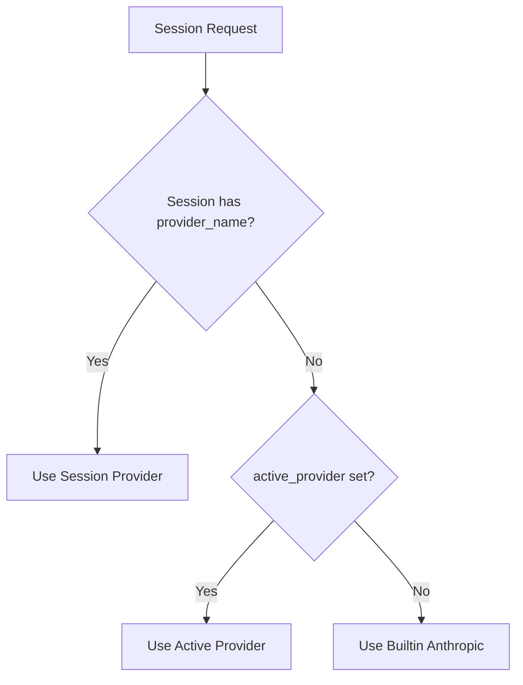

# Configuration

This document describes all configuration options for ccc (Claude Code Companion).

## Configuration File Location

The main configuration file is stored at:

```
~/.config/ccc/config.json
```

**Auto-migration:** If you have an old `~/.ccc.json` file, it will be automatically migrated to the new location.

## Configuration Structure

```json
{
  "bot_token": "your-telegram-bot-token",
  "chat_id": 123456789,
  "group_id": -1001234567890,
  "sessions": {
    "myproject": {
      "topic_id": 42,
      "path": "/home/user/Projects/myproject",
      "claude_session_id": "sess_abc123",
      "provider_name": "default"
    }
  },
  "projects_dir": "~/Projects",
  "transcription_lang": "en",
  "relay_url": "https://ccc-relay.example.com",
  "away": false,
  "oauth_token": "",
  "otp_secret": "",
  "active_provider": "",
  "providers": {
    "example-provider": {
      "base_url": "https://api.example.com/v1",
      "auth_env_var": "EXAMPLE_API_KEY",
      "opus_model": "claude-3-opus-20250214",
      "sonnet_model": "claude-3-7-sonnet-20250214",
      "haiku_model": "claude-3-5-haiku-20250214",
      "subagent_model": "claude-3-5-haiku-20250214",
      "config_dir": "~/.claude",
      "api_timeout": 120000
    }
  }
}
```

**Note:** The example above shows a custom provider configuration. In practice, you would:
- Replace `example-provider` with your provider name
- Replace `base_url` with your provider's API endpoint
- Replace `auth_env_var` with your environment variable name
- Adjust model names to match your provider's offerings

## Configuration Fields

### Required Fields

| Field | Type | Description |
|-------|------|-------------|
| `bot_token` | string | Your Telegram bot token from @BotFather |
| `chat_id` | int64 | Your Telegram user ID (auto-detected during setup) |

### Optional Fields

| Field | Type | Default | Description |
|-------|------|---------|-------------|
| `group_id` | int64 | - | Telegram group ID for session topics |
| `sessions` | map | `{}` | Session configurations |
| `projects_dir` | string | `~` | Base directory for new projects |
| `transcription_lang` | string | - | Language code for voice transcription |
| `relay_url` | string | - | Relay server URL for large file transfers |
| `away` | bool | `false` | Enable notification mode |
| `oauth_token` | string | - | Claude Code OAuth token |
| `otp_secret` | string | - | TOTP secret for permission approval |
| `active_provider` | string | (empty) | Default provider for new sessions (empty = builtin) |
| `enable_streaming` | bool | `false` | Enable real-time streaming for AI responses (typing effect) |
| `providers` | map | `{}` | Named provider configurations |

## Session Configuration

Each session in the `sessions` map has the following structure:

```json
{
  "topic_id": 42,
  "path": "/home/user/Projects/myproject",
  "claude_session_id": "sess_abc123",
  "provider_name": "default",
  "is_worktree": false,
  "worktree_name": "",
  "base_session": ""
}
```

| Field | Type | Description |
|-------|------|-------------|
| `topic_id` | int64 | Telegram topic ID for this session |
| `path` | string | File system path for the project |
| `claude_session_id` | string | Claude Code session ID for resuming |
| `provider_name` | string | Provider to use for this session |
| `is_worktree` | bool | Whether this is a git worktree session |
| `worktree_name` | string | Name of the worktree |
| `base_session` | string | Base session for worktree |

## Provider Configuration

ccc uses a provider abstraction to support multiple AI providers. Each provider has its own configuration.

### Provider Fields

| Field | Type | Description |
|-------|------|-------------|
| `base_url` | string | API base URL for the provider |
| `auth_token` | string | API key/token (not recommended, use auth_env_var) |
| `auth_env_var` | string | Environment variable containing API key |
| `opus_model` | string | Model name for Opus tier |
| `sonnet_model` | string | Model name for Sonnet tier |
| `haiku_model` | string | Model name for Haiku tier |
| `subagent_model` | string | Model name for subagent tasks |
| `config_dir` | string | Provider-specific config directory |
| `api_timeout` | int | API timeout in milliseconds |

### Provider Resolution

When creating a session, the provider is determined in this order:

1. **Session provider**: Stored in the session after explicit selection from `/new`, `/provider`, or `--provider`
2. **Active provider**: Uses `active_provider` from config
3. **Builtin provider**: Falls back to the default Anthropic provider

Telegram session messages show both the provider and its source (`session`, `active default`, or `builtin default`). New session topics also pin a plain-text header with the session name, provider, and resolved path:

```text
session: myproject
provider: anthropic
path: /Users/you/Projects/myproject
```

For worktree sessions, `path` is the full worktree directory.



### Builtin Provider

The builtin provider uses Claude Code's default configuration:

- Uses `CLAUDE_API_KEY` or Claude's OAuth
- Respects `ANTHROPIC_BASE_URL` environment variable (if set)
- Uses Claude Code's default model configuration
- Uses Claude Code's default config directory (`~/.claude`)

This is the default option and requires no additional configuration.

### Configured Provider

Configured providers allow you to use different AI services or custom endpoints:

```json
{
  "providers": {
    "custom-provider": {
      "base_url": "https://api.example.com/v1",
      "auth_env_var": "MY_API_KEY",
      "sonnet_model": "claude-3-7-sonnet-20250214",
      "config_dir": "~/.custom-provider"
    }
  },
  "active_provider": "custom-provider"
}
```

**Note:** Replace `custom-provider`, `base_url`, and other values with your specific provider details.

**Environment Variable Expansion:**

The `auth_env_var` field is read from the environment at runtime:

```json
{
  "auth_env_var": "MY_API_KEY"
}
```

ccc will read the `MY_API_KEY` environment variable and pass it to Claude Code.

## Permission Modes

ccc supports two permission modes for controlling tool approvals:

### Auto-approve Mode (Default)

All permissions are automatically approved. No interaction required.

**Configuration:** Leave `otp_secret` empty or unset.

### OTP Mode

Remote prompts require TOTP code approval (like Google Authenticator).

**Configuration:**
```bash
ccc config otp enable
```

This generates a TOTP secret and stores it in `otp_secret`.

**How it works:**

1. Claude requests permission for a tool
2. ccc sends a permission request to Telegram
3. You reply with your 6-digit TOTP code
4. Permission is approved and Claude continues

## Projects Directory

The `projects_dir` setting controls where new projects are created:

```json
{
  "projects_dir": "~/Projects"
}
```

**Behavior:**

| Command | Result |
|---------|--------|
| `/new myproject` | Creates `~/Projects/myproject` |
| `/new ~/experiment/test` | Creates `~/experiment/test` (absolute path) |
| `/new /tmp/quicktest` | Creates `/tmp/quicktest` (absolute path) |

## Provider Trusted Directories

When a provider is used, ccc automatically configures trusted directories in the provider's settings.json to prevent the "Do you trust the files in this folder?" prompt.

**Auto-configured directories:**

- `~` (home directory)
- `~/Projects`
- `~/Projects/cli`
- `~/Projects/sandbox`

These directories are added to the provider's `trustedDirectories` setting with `autoApprove.trustDirectories: true`.

## File Locations

### Configuration

| Platform | Path |
|----------|------|
| All | `~/.config/ccc/config.json` |

### Runtime Data

| Platform | Path |
|----------|------|
| macOS | `~/Library/Caches/ccc/` |
| Linux | `~/.cache/ccc/` |

**Contents:**

- `ccc.log` - Listener output log
- `hook-debug.log` - Hook debug log
- `ccc.lock` - Listener lock file
- `tools-*.json` - Per-session tool call display state
- `thinking-*` - Per-session typing indicator flags
- `telegram-active-*` - Telegram-initiated input flags

### Hooks

| Platform | Path |
|----------|------|
| All | `~/.claude/hooks/` |

**Hook files:**

- `pre-run` - Executed before any command
- `post-run` - Executed after command completion
- `ask` - Executed before permission approval

## Atomic Configuration Writes

ccc uses atomic writes for configuration updates to prevent data corruption:

1. Write to temporary file (`config-*.json.tmp`)
2. Rename temporary file to `config.json`

This prevents corruption if multiple ccc processes write simultaneously.

## Configuration Commands

### View Configuration

```bash
ccc config                    # Show all configuration
ccc config projects-dir       # Show projects directory
ccc config otp                # Show OTP mode status
```

### Set Configuration

```bash
ccc config projects-dir ~/Projects    # Set projects directory
ccc config otp enable                 # Enable OTP mode
ccc config otp disable                # Disable OTP mode
```

### Provider Commands

```bash
ccc provider                 # List providers for the current session
ccc provider <provider-name> # Change provider when current directory maps to a session
```

## Environment Variables

ccc respects the following environment variables:

| Variable | Description |
|----------|-------------|
| `CCC_CONFIG` | Override config file path |
| `HOME` | User home directory |
| `PATH` | Used to find claude binary |

## Examples

### Minimal Configuration

```json
{
  "bot_token": "123456789:ABCdefGHIjklMNOpqrsTUVwxyz",
  "chat_id": 123456789
}
```

### Full Configuration

```json
{
  "bot_token": "123456789:ABCdefGHIjklMNOpqrsTUVwxyz",
  "chat_id": 123456789,
  "group_id": -1001234567890,
  "projects_dir": "~/Projects",
  "transcription_lang": "en",
  "relay_url": "https://ccc-relay.example.com",
  "away": false,
  "otp_secret": "JBSWY3DPEHPK3PXP",
  "active_provider": "example-provider",
  "providers": {
    "example-provider": {
      "auth_env_var": "EXAMPLE_API_KEY",
      "sonnet_model": "claude-3-7-sonnet-20250214",
      "haiku_model": "claude-3-5-haiku-20250214"
    },
    "alternative-provider": {
      "base_url": "https://api.example.com/v1",
      "auth_env_var": "ALT_API_KEY",
      "sonnet_model": "claude-3-7-sonnet-20250214",
      "config_dir": "~/.alt-provider"
    }
  },
  "sessions": {
    "myproject": {
      "topic_id": 42,
      "path": "/home/user/Projects/myproject",
      "claude_session_id": "sess_abc123",
      "provider_name": "example-provider"
    }
  }
}
```
